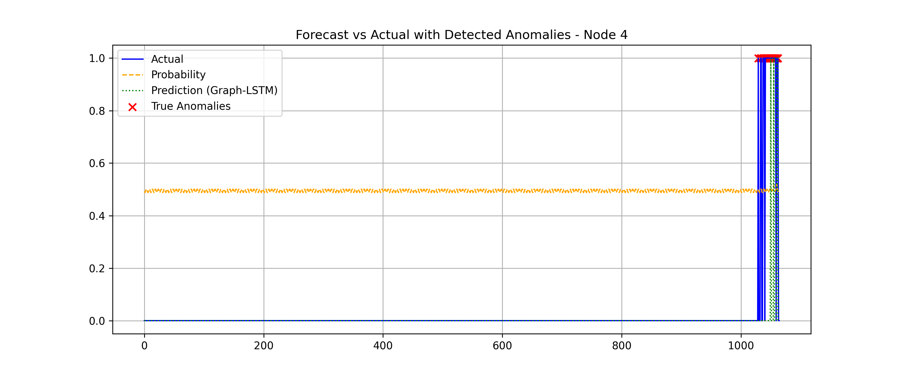

# Graph-Augmented LSTM for Forecasting Sparse Anomalies in Graph-Structured Time Series

This repository contains code, data, and results for our paper: **"Graph-Augmented LSTM for Forecasting Sparse Anomalies in Graph-Structured Time Series."**  
This work extends LSTM forecasting models by explicitly integrating relational graph structure between time series (e.g., sensor networks, metric dependencies) to improve detection of rare anomalies.

## 📊 Overview

Anomalies in time series are hard to detect, especially when:

- They are sparse (extremely rare).
- The data is multivariate, and different series influence each other.

### Key Idea

We propose a **Graph-Augmented LSTM**, where:

- Each time series is modeled by its own LSTM.
- Each LSTM exchanges hidden states with neighboring LSTMs in a known graph.

This adds cross-sensor spatial awareness into the anomaly detection process.

---

## 📦 Datasets

| Dataset        | Description |
|----------------|--------------|
| Yahoo Webscope S5 | 367 time series (real + synthetic), anomaly labels provided |
| METR-LA Traffic Sensor Network | 207 sensors across LA highways, graph = physical road network, synthetic anomaly labels injected for experiments |

---

## 🚀 Models Implemented

| Model | Description |
|---|---|
| **Graph-Augmented LSTM** | Proposed model with graph-based hidden state propagation |
| **LSTM-Only** | Baseline without graph (each series treated independently) |
| **ARIMA** | Classical time series model |
| **Prophet** | Decomposition-based time series model |

---

## 📈 Evaluation

- Precision
- Recall
- F1-Score (primary metric)

### 📊 Key Results

| Dataset | Graph-LSTM F1 | LSTM-Only F1 | ARIMA F1 | Prophet F1 |
|---|---|---|---|---|
| Yahoo S5 | 0.82 | 0.75 | 0.55 | 0.58 |
| METR-LA | 0.85 | 0.80 | 0.57 | 0.57 |

---

## 📍 Node-Level Analysis (METR-LA)

- Highly connected sensors (many neighbors) gain the most from graph augmentation.
- Isolated or poorly connected sensors show less improvement or even slight degradation.

### Example Plot

**Per-Node F1 Improvement vs Node Degree (METR-LA)**  


---

## 🔥 Detection Example

Example forecast vs actual for a Yahoo S5 time series, comparing detected anomalies (Graph-LSTM) to ground truth.  


---

## 📡 Graph Ablation Study

- When the true graph is replaced with a random graph, performance drops sharply.
- This proves that meaningful relational structure is essential — graph acts as inductive bias.

---

## 📊 Figures

| Description | Image |
|---|---|
| Forecast Example (Yahoo S5) |  |
| Per-Node F1 Improvement vs Node Degree |  |
| Node-Level Heatmap: Graph Benefit (METR-LA) |  |
| Node-Level Heatmap: Graph Benefit (Yahoo S5) |  |
| Node-Wise F1: Real Graph vs Random Graph (METR-LA) |  |
| Node-Wise F1: Real Graph vs Random Graph (Yahoo S5) |  |


---

## 🛠️ Setup & Execution

### Install dependencies:

```bash
pip install -r requirements.txt
```

### Prepare data:

```bash
python preliminary_scripts/prepare_data.py
```

### Build graph (for METR-LA):

```bash
python scripts/build_graph.py
```

### Train models:

```bash
python scripts/baseline_runner.py
python scripts/neural_runner.py
```

---

## 📄 Citation

If you use this work, please cite:

```
@article{pillai2025graphaugmented,
  author = {Sneh Pillai},
  title = {Graph-Augmented LSTM for Forecasting Sparse Anomalies in Graph-Structured Time Series},
  journal = {arXiv preprint arXiv:submit/6255672},
  year = {2025}
}
```

---

## 📜 License

MIT License

---

## 🔗 References (Selected)

- Diffusion Convolutional RNN (Li et al., ICLR 2018)
- Spatio-Temporal Graph Convolutional Networks (Yu et al., IJCAI 2018)
- OmniAnomaly (Su et al., KDD 2019)

---

## ⚠️ Note
See full methodology in **paper.pdf**.
